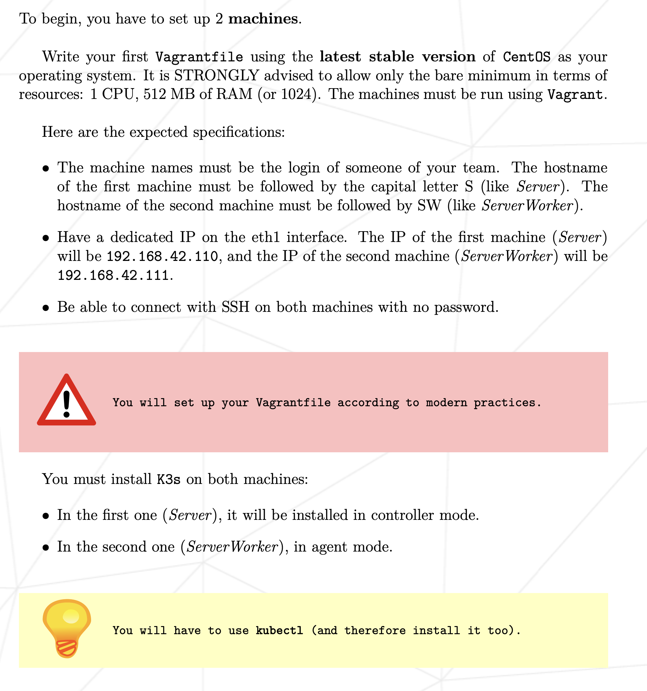
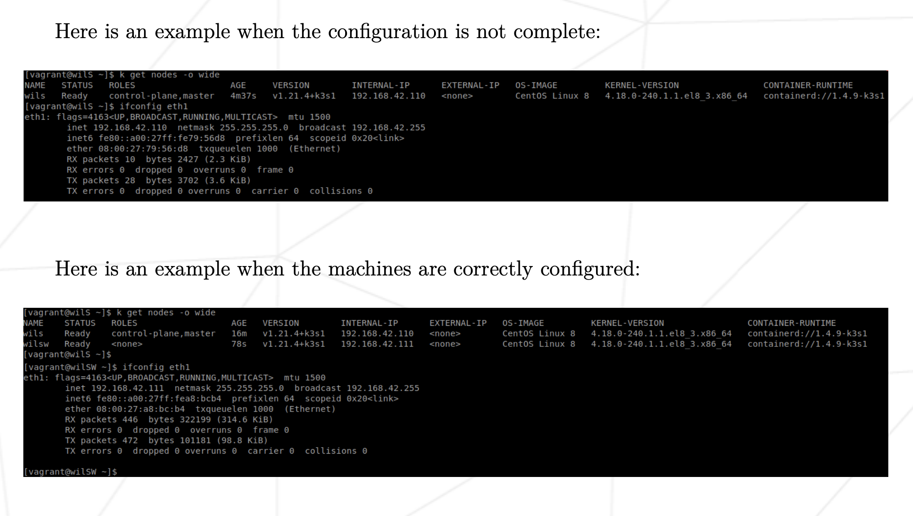
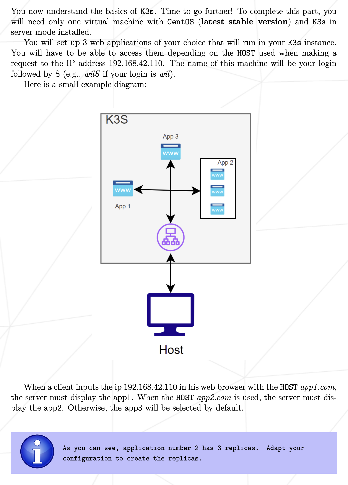
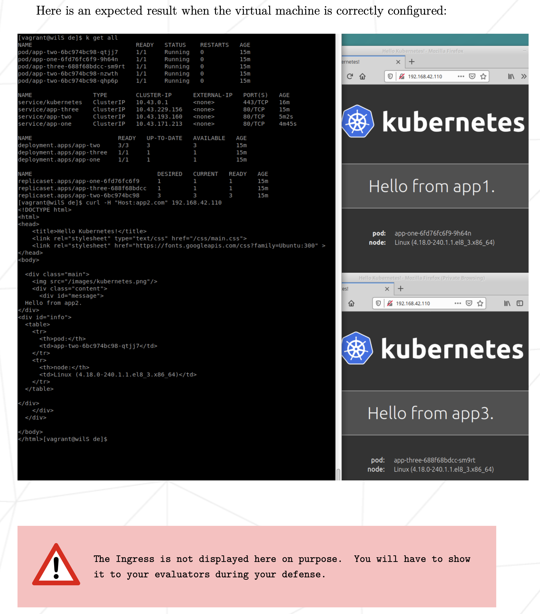
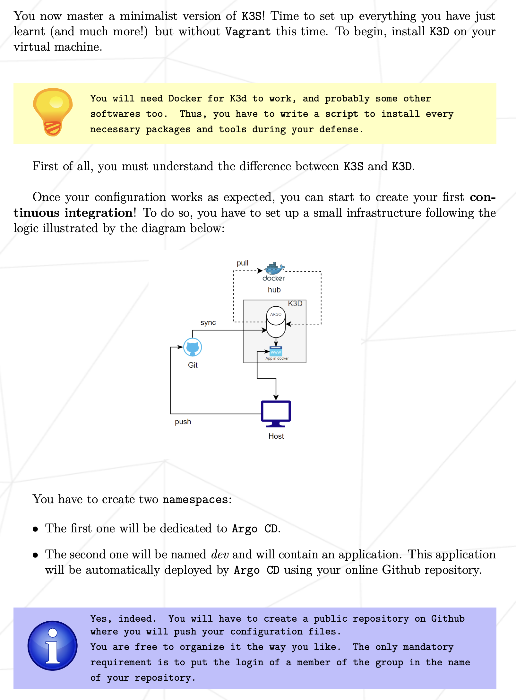
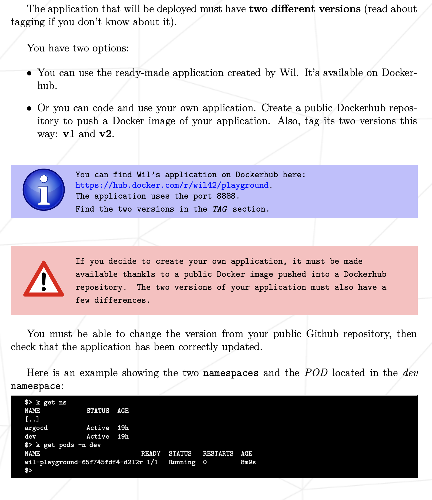
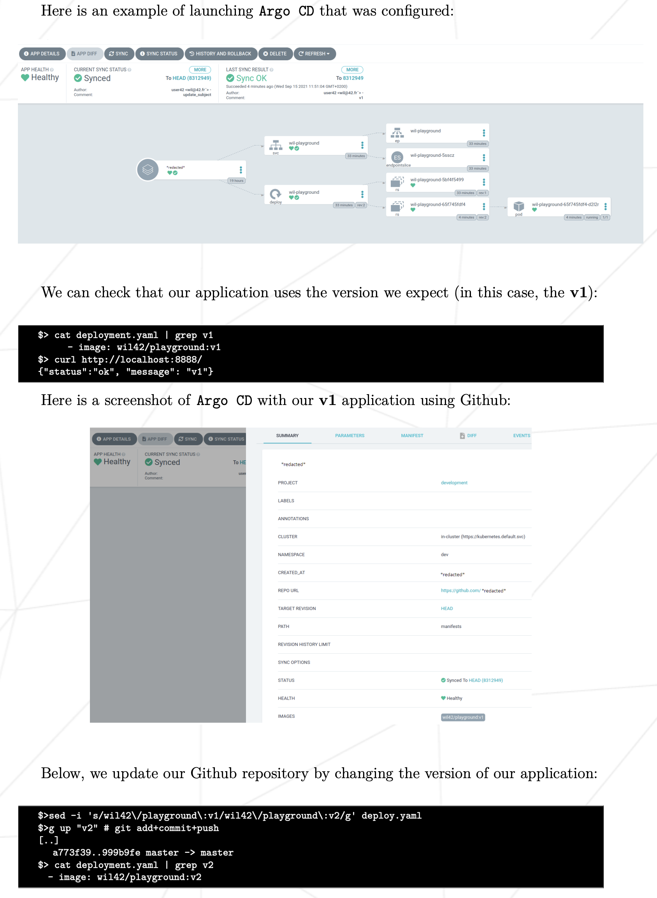
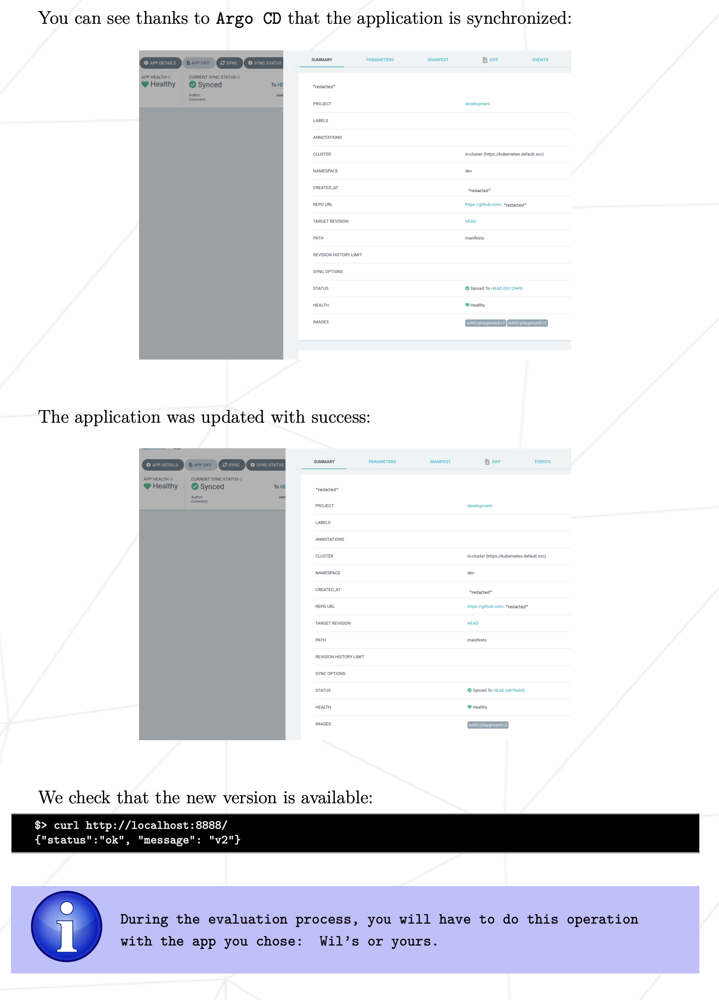

# Container Orchestration using Kubernetes 

Inception-Of-Things is a school project helps to learn container orchestration and continuous integration.  

This project aims to deepen your knowledge by making you use K3d and K3s with Vagrant.  
You will learn how to set up a personal virtual machine with Vagrant and CentOS.  
Then, you will learn how to use K3s and its Ingress. Last but not least, you will discover K3d that will simplify your life.  
These steps will get you started with Kubernetes.  

# General guidelines

The whole project has to be done in a virtual machine.  
• You have to put all the configuration files of your project in folders located at the root of your repository (go to Submission and peer-evaluation for more information).  
• The folders of the mandatory part will be named: p1, p2 and p3. And the bonus one: bonus.  
• This topic requires you to apply concepts that, depending on your background, you may not have covered yet.  
We therefore advise you not to not be afraid to read a lot of documentation to learn how to use K8s with K3s, as well as K3d.  

# Mandatory part

This project will consist of setting up several environments under specific rules.  
It is divided into three parts you have to do in the following order:  
• Part 1: K3s and Vagrant.  
• Part 2: K3s and three simple applications.  
• Part 3: K3d and Argo CD.  

# Part 1: K3s and Vagrant

# Part 2: K3s and three simple applications

# Part 3: Part 3: K3d and Argo CD

